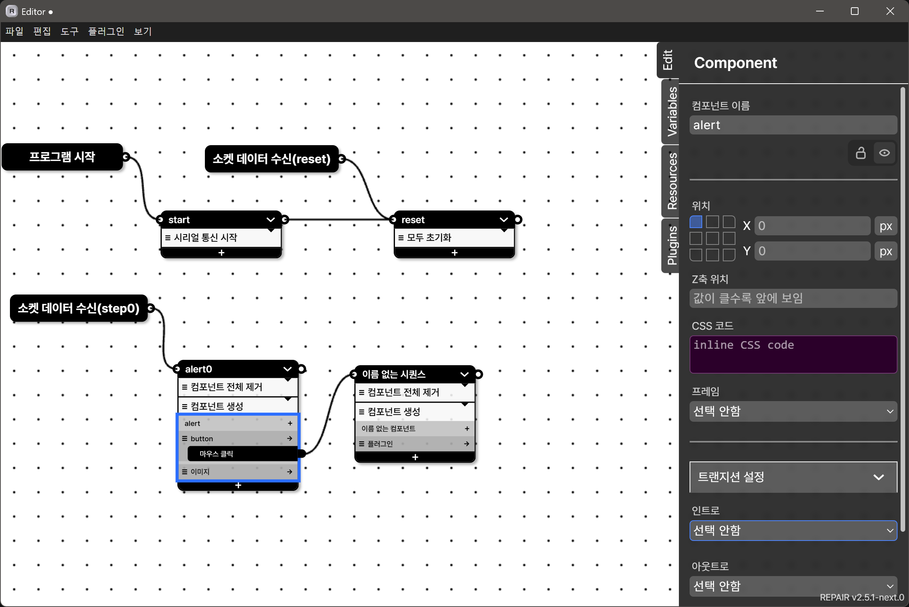

# REPAIR v2

Room Escape Pc App InteRface  
방탈출/전시/인터랙티브 공간용 PC 인터페이스 제작 및 실행 도구입니다.



## 기술 스택

- Electron
- Vite / electron-vite
- Svelte 5
- Node.js
- serialport
- socket.io-client

## 설치

```bash
npm install
```

## 개발 실행

```bash
npm run dev
```

이 명령은 아래 프로세스를 함께 실행합니다.

- Electron main process
- editor renderer
- play renderer

개별 실행:

```bash
npm run dev:editor
npm run dev:play
```

## 빌드

```bash
npm run build
```

Windows 설치 파일 빌드:

```bash
npm run build:win
```

압축 해제된 앱 빌드:

```bash
npm run build:unpack
```

## 프로젝트 파일

REPAIR v2 프로젝트는 `.repair` 확장자를 사용합니다.

기본 템플릿:

- `templates/projects/default.repair`
- `templates/projects/empty.repair`

## 디렉터리 구조

```txt
src/main/                 Electron main process
src/main/communication/   serial, socket, bonjour 통신
src/main/plugin/          플러그인 로딩/빌드/런타임
src/renderer/editor/      에디터 화면
src/renderer/play/        플레이어 화면
src/renderer/classes/     프로젝트 데이터 모델
templates/                프로젝트/플러그인 템플릿
docs/plugin-sdk/          플러그인 SDK 문서
packages/plugin-sdk/      플러그인 SDK 패키지
resources/                앱 아이콘 및 리소스
```

## 플러그인 개발

플러그인 SDK 문서는 아래에서 확인할 수 있습니다.

- `docs/plugin-sdk/README.md`
- `docs/plugin-sdk/ko/README.md`

플러그인 타입:

- element
- frame
- function
- transition
- runtime

플러그인 스캐폴드는 `templates/plugin-scaffold/`에 있습니다.

## 주요 npm scripts

| script                 | 설명                              |
| ---------------------- | --------------------------------- |
| `npm run dev`          | 개발 모드 실행                    |
| `npm run start`        | 빌드 결과 preview 실행            |
| `npm run build`        | main/editor/play/splash 전체 빌드 |
| `npm run build:main`   | Electron main 빌드                |
| `npm run build:editor` | editor renderer 빌드              |
| `npm run build:play`   | play renderer 빌드                |
| `npm run build:win`    | Windows 설치 파일 생성            |
